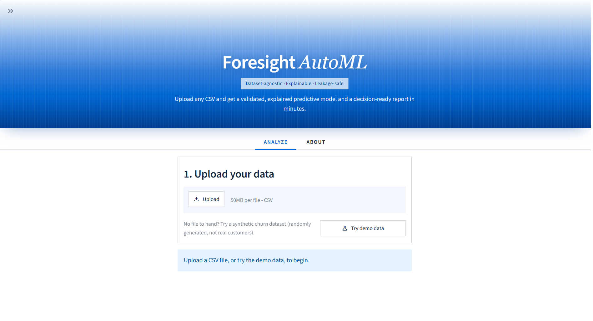
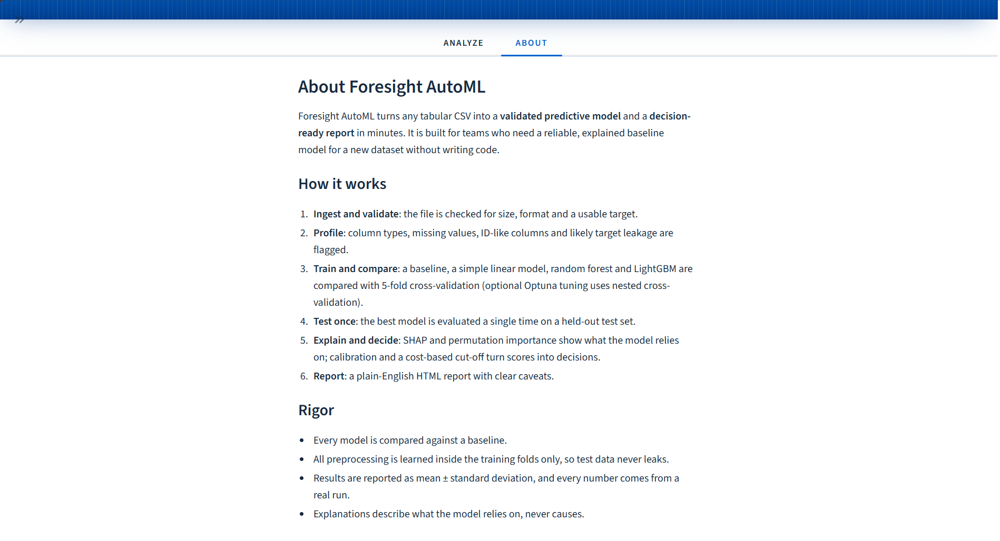

# Foresight AutoML

**A dataset-agnostic system for explainable predictive modeling and decision support.**

Upload any tabular CSV, choose what to predict, and get a validated predictive model, a
plain-English explanation of what it relies on, and a decision-ready report, in minutes and
without writing code.



## Why it exists

Teams often need a reliable first model for a new dataset (churn, attrition, credit risk,
demand) but lack the time to build one carefully. Foresight AutoML automates the careful
parts that are easy to get wrong: a proper baseline, leakage-safe preprocessing, a held-out
test set that is used only once, honest uncertainty, and explanations framed around the
business decision rather than model internals.

## Features

- **Any CSV, any target:** detects yes/no, category or number prediction, and asks when it is ambiguous.
- **Data checks:** column types, missing values, constant and ID-like columns, numbers stored as text, class imbalance, and **likely target leakage**.
- **Fair model comparison:** a baseline, a simple linear model, random forest and LightGBM, compared with 5-fold cross-validation (mean ± standard deviation).
- **One honest test:** the best model is scored once on a 20% held-out test set.
- **Explanations:** SHAP and permutation importance, cross-checked against each other, with plain-English direction hints ("higher values go with more likely 'Yes'").
- **From scores to decisions:** calibrated probabilities, a cost-based cut-off, and a lift chart showing who to act on first.
- **Reports:** a self-contained HTML report that also prints cleanly to PDF.
- **Optional extras:** Optuna tuning with nested cross-validation, local MLflow run tracking, and a Gemini-written summary whose numbers are checked against the real results.

## How it works

1. **Ingest and validate:** size, format and target checks. The file stays in memory.
2. **Profile:** column types and quality flags, plus a leakage check that trains one small model per column.
3. **Train and compare:** every step that learns from data runs inside scikit-learn Pipelines, so it is fitted on training folds only.
4. **Test once:** the winning model is evaluated a single time on held-out data.
5. **Explain and decide:** SHAP, permutation importance, calibration and a cost-based cut-off.
6. **Report:** a plain-English summary, results, caveats and method notes.

## Walkthrough: IBM HR employee attrition

A real run on the public **IBM HR Analytics Employee Attrition** dataset (1,470 employees,
35 columns), predicting `Attrition` ("Yes" = the employee left). All numbers below come from
this run.

### 1. Upload and choose the target


### 2. Data checks

The app flagged `EmployeeCount` as constant and `EmployeeNumber` as ID-like and left both
out. It also detected the class imbalance (16.2% "Yes"), so it chose models by **PR-AUC**
instead of accuracy and weighted the models toward the rare class.


### 3. Train and compare

Options (decision costs, tuning, AI summary, run log) sit in one collapsible box; a progress
bar and step tracker show where the run is.


### 4. Results

**Overview.** On 294 held-out employees, the best model (logistic regression) scored
**PR-AUC 0.561**, against **0.162** for a baseline that ignores all inputs
(ROC-AUC 0.803).


**Models.** The simple logistic regression (PR-AUC 0.606 ± 0.082 in cross-validation) beat
random forest (0.566 ± 0.069) and LightGBM (0.560 ± 0.051), so the tool kept the simpler,
easier-to-explain model.


**Decisions.** Calibration made the probabilities more trustworthy (test Brier score
0.156 → 0.102). Acting on the top 10% highest-risk employees would reach 38% of all leavers,
3.8× better than random. With equal costs, the cut-off chosen on training data (0.38) cost
slightly more on the test set than the default 0.50 (143 vs 129 per 1,000 employees), and the
app says so rather than hiding it.


**What the model relies on.** `OverTime`, `JobRole` and `JobLevel` carry the most weight,
with readable patterns such as "'Yes' (overtime) goes with more likely leaving". SHAP and
permutation importance share 3 of their top 5 columns. These show what the model relies on,
not what causes attrition.


**Data and caveats.** Caveats are generated from the run itself, next to the full data-check
table.


### 5. Report (HTML and PDF)

The downloadable report is a single HTML file. Press Ctrl+P and choose Save as PDF for a
paginated copy with colours, charts and page numbers kept.


More PDF pages: [2](docs/images/14_report%20pdf%202.png) ·
[3](docs/images/14_report%20pdf%203.png) · [4](docs/images/14_report%20pdf%204.png) ·
[5](docs/images/14_report%20pdf%205.png)

### About tab



## Benchmarks

Download the datasets listed in `benchmarks/datasets.json` into `benchmarks/data/`
(not committed), then run:

```powershell
venv\Scripts\python.exe -m benchmarks.run_benchmarks
```

This writes `benchmarks/results.csv` and one HTML report per dataset to
`outputs/benchmark_reports/`. Results from the latest run (seed 42, 5-fold CV,
20% held-out test set):

| Dataset | Rows | Task | Metric | Baseline | Simple model | Best model (CV mean ± std) | Test |
|---|---|---|---|---|---|---|---|
| Telco churn (IBM) | 7,043 | binary | ROC-AUC | 0.500 | 0.858 | Logistic regression 0.858 ± 0.013 | 0.847 |
| German credit (UCI) | 1,000 | binary | ROC-AUC | 0.500 | 0.771 | Random forest 0.791 ± 0.039 | 0.782 |
| Bank marketing (UCI) | 45,211 | binary, imbalanced (11.7%) | PR-AUC | 0.117 | 0.398 | LightGBM 0.443 ± 0.011 | 0.464 |
| Bike sharing, hourly (UCI) | 17,379 | regression | RMSE (lower is better) | 182.2 | 142.6 | LightGBM 41.2 ± 1.6 | 39.0 |

Each dataset runs end to end in 7-30 seconds on a laptop (including the decision analysis below).

**From scores to decisions (binary datasets).** Calibration and the cut-off are chosen on
out-of-fold predictions for the training data, then checked once on the test set:

| Dataset | Costs (false alarm : miss) | Calibrated? (test Brier) | Cut-off | Test cost per 1,000 rows: cut-off 0.50 → chosen | Positives caught | Lift in top 10% |
|---|---|---|---|---|---|---|
| Telco churn | 1 : 1 | No (0.137) | 0.53 | 198.7 → 199.4 | 54% | 2.8× |
| German credit | 1 : 5 (documented) | Yes, 0.165 → 0.158 | 0.16 | 830 → 530 | 92% | 2.5× |
| Bank marketing | 1 : 1 | Yes, 0.147 → 0.080 | 0.53 | 104.3 → 103.8 | 19% | 4.5× |

With the German credit cost matrix, the chosen cut-off (0.16) matches the theoretical
optimum for calibrated probabilities, 1 / (1 + 5) ≈ 0.17, and cuts the test-set cost by 36%.
With equal costs the chosen cut-off stays near 0.50, as expected; on Telco it was marginally
worse than 0.50 on the test set, which the report states rather than hides.

**Optional tuning.** `--tune` (or the "Also tune" checkbox in the app) adds Optuna-tuned
random forest and LightGBM. Tuning runs inside **nested cross-validation**: each outer fold
gets its own search on its training part only, so tuned scores are directly comparable with
the untuned ones and not optimistic. Tuned results are written to `benchmarks/results_tuned.csv`.

```powershell
venv\Scripts\python.exe -m benchmarks.run_benchmarks --tune
```

Latest tuned run (up to 20 trials and 30 seconds per search):

| Dataset | Metric | Untuned best (CV) | Tuned best, nested CV | Test: untuned → tuned | Run time |
|---|---|---|---|---|---|
| Telco churn | ROC-AUC | Logistic regression 0.858 ± 0.013 | LightGBM 0.867 ± 0.011 | 0.847 → 0.858 | 4.5 min |
| German credit | ROC-AUC | Random forest 0.791 ± 0.039 | LightGBM 0.797 ± 0.044 | 0.782 → 0.788 | 2.5 min |
| Bank marketing | PR-AUC | LightGBM 0.443 ± 0.011 | LightGBM 0.453 ± 0.014 | 0.464 → 0.468 | 6.5 min |
| Bike sharing | RMSE (lower is better) | LightGBM 41.2 ± 1.6 | LightGBM 38.9 ± 1.0 | 39.0 → 36.5 | 6.3 min |

Tuning helped on every dataset, but on the three classification datasets the gain is within
one standard deviation; the clearest improvement is bike demand (RMSE −5% in CV, −6% on test).
The 30-second limit was reached on Telco, bank and bike, so a rerun can give slightly
different tuned numbers (it ran fewer than 20 trials there).

**Leakage handling.** The automatic check excluded `Churn Value` and `Churn Reason`
(Telco). Three known leaks are dropped in `datasets.json`, each with a documented reason:
`Churn Score` (another model's prediction; flagged by the warning tier at single-column
ROC-AUC 0.942), `duration` (bank; only known after the call), and `casual` + `registered`
(bike; they sum to the target). The single-column check cannot catch leaks that are
spread across columns or depend on timing, so a human review step is still needed.

## Rigor, privacy and safety

- **No test-set leakage:** preprocessing is fitted inside each training fold; the test set is
  used exactly once, and tests check that flipping every test label changes no choice.
- **Honest uncertainty:** cross-validation results are reported as mean ± standard deviation,
  and tuning uses nested cross-validation.
- **Uploads stay local:** files are read in memory and never written to disk; the app only
  listens on `localhost`, and error messages never show stack traces or file paths.
- **Untrusted text stays text:** column names and values are escaped everywhere (HTML report,
  Markdown, charts), and spreadsheet formula injection is neutralized in exports.
- **No hidden network calls:** MLflow's telemetry is switched off before it loads, verified by
  a test with all network connections blocked.

**Optional run tracking (MLflow, local only).** Tick "Save this run to the local MLflow log"
in the app, or add `--track` to the benchmark command. Each run's settings, CV and test
metrics, data profile, importance table, report and model are stored in `mlflow.db` and
`mlruns/` (both git-ignored). List recent runs with:

```powershell
venv\Scripts\python.exe -m foresight.tracking
```

**Plain-English summary (template, or optionally Gemini).** Every report starts with a short
summary written directly from the results. In the app you can instead ask Gemini to write it:

1. Copy `.env.example` to `.env` and put your key after `GEMINI_API_KEY=` (never commit `.env`).
2. Tick "Write the summary with Gemini" in the Options box before training. It is off by default.

Only aggregated results are sent (scores, model names, importance shares, decision numbers),
never data rows. Column names, class labels and the target name are replaced by placeholders
such as `[COLUMN_1]`, so uploaded text never reaches Gemini and cannot inject instructions.
Gemini's answer is checked before use: every number must match a real result, only known
placeholders may appear, and causal claims, links, HTML and cut-off answers are rejected. If
any check fails or the call fails, the template summary is shown and the report says why.
The model name is set in `foresight/config.py` (`GEMINI_MODEL`). Benchmarks never call Gemini.

## Quickstart (Windows PowerShell)

```powershell
python -m venv venv
venv\Scripts\python.exe -m pip install -r requirements.txt
venv\Scripts\python.exe -m streamlit run app.py
```

Local development: The app runs locally by default, and uploaded files are processed in memory rather than persisted by the application.

Then open http://localhost:8501. The app is only reachable from your own computer,
and uploaded files stay in memory (they are never written to disk). No dataset to hand?
Click **Try demo data** for a synthetic churn dataset.

Run the tests (300+ automated tests):

```powershell
venv\Scripts\python.exe -m pytest
```

## Project structure

```
app.py                  Streamlit app (UI)
foresight/
  config.py             all limits, thresholds, seeds and colours
  ingest.py             safe CSV loading, validation, problem-type detection
  profile.py            data profiling and leakage check
  preprocess.py         leakage-safe Pipelines (imputation, scaling, encoding)
  models.py             baselines, candidates and metrics
  train.py              split, cross-validation, selection, one test evaluation
  tune.py               optional Optuna tuning with nested CV
  explain.py            SHAP and permutation importance
  decision.py           calibration, cost-based cut-off, lift
  narrate.py            template summary and optional checked Gemini summary
  tracking.py           optional local MLflow tracking (telemetry off)
  report.py             HTML report (Jinja2, autoescaped)
benchmarks/             benchmark runner, dataset list and results
tests/                  one test file per module
docs/images/            screenshots used in this README
```

## Limitations

- The leakage check looks at one column at a time; leaks spread across columns or caused by
  timing still need a human review.
- Date columns are not used as model inputs yet.
- Results assume future data looks like the training data.

## Author

Built by **Hrisita Mohapatra**.
